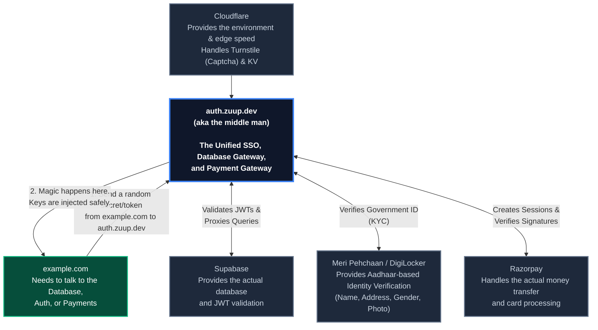

# Zuup Auth: The Ultimate Middleman

Welcome to the **Zuup Auth Gateway**! 

Think of this as the bouncer, the cashier, and the ID checker for all your websites, rolled into one blazing-fast Cloudflare Worker.

If you have a frontend app (like `example.com`), you **never** want to expose your actual database keys or payment secrets to the browser. Instead, your frontend talks to `auth.zuup.dev` (the middleman). We verify who they are, inject the super-secret keys server-side, and then securely talk to Supabase, Razorpay, or the Indian Government on their behalf. 

## The Architecture (How it works)



---

## ✨ Core Features

1. **🔒 Secure Database Proxy:** We intercept Supabase requests, validate a custom `GATEWAY_SECRET` from your frontend, and silently swap it with your hidden `SERVICE_ROLE` or `ANON` keys. Your frontend never knows the real keys!
2. **🔑 "Sign in with Zuup" SSO:** A full OAuth 2.0 Identity Provider. Let users log in to *any* of your side projects using their central Zuup account.
3. **💳 Unified Payment Gateway:** A beautiful, Razorpay-powered checkout UI. Your frontend just asks for a session, and we handle the messy webhooks and signature verification.
4. **🇮🇳 KYC Identity Verification:** Seamlessly verify users' real-world identities via Meri Pehchaan (DigiLocker) using a gorgeous, secure popup window.

---

## Developer Guide: How to use it in your app

### 1. The Database Proxy (Hiding your Supabase keys)
In your frontend application (e.g. `example.com`), you don't use your real Supabase URL. You use this worker!

```env
# In your frontend .env
VITE_SUPABASE_URL=https://auth.zuup.dev
VITE_SUPABASE_ANON_KEY=my_super_secret_gateway_key_99
```

When you initialize `supabase-js`, it sends requests to us. We check the gateway key, laugh at hackers, swap in the real keys, and forward it to Supabase. 100% secure.

### 2. "Sign in with Zuup" (SSO)
Want to let users log into a new project using Zuup?
1. Redirect them to `https://auth.zuup.dev/login?client_id=YOUR_APP&redirect_uri=https://example.com/callback`
2. They log in safely on our UI.
3. We redirect them back with a `code`.
4. Your backend calls `POST /api/oauth/token` with that code to get their profile and JWT!

### 3. Identity Verification (Meri Pehchaan / KYC)
Need to prove someone is a real human from India? We've built a drop-in, Razorpay-style popup that uses DigiLocker!

**Step 1:** Create a session from your backend.
```javascript
const response = await fetch("https://auth.zuup.dev/api/kyc/create-session", {
  method: "POST",
  headers: { "Content-Type": "application/json" },
  body: JSON.stringify({
    redirect_uri: "https://example.com/kyc-success",
    client_name: "Example App"
  })
});
const { session_id } = await response.json();
```

**Step 2:** Open the magical popup in your frontend.
```javascript
window.open(
  `https://auth.zuup.dev/kyc?session_id=${session_id}`,
  'Zuup_KYC',
  'width=500,height=750'
);
```
The user sees a beautiful dark-mode UI, completes the DigiLocker flow, and their government details (Photo, Address, DOB, Masked Aadhaar) are instantly saved to the `kyc_verifications` table in Supabase. Your frontend popup then redirects back to your success page!

### 4. Taking Payments (Razorpay)
Stop writing messy webhook code on every project!
1. Call `POST /api/payments/create-session` from your backend to get a `sessionUrl`. You can even pass a custom Supabase RPC endpoint that we will automatically hit when the payment succeeds!
2. Open the `sessionUrl` in a popup on your frontend.
3. Poll `GET /api/payments/session/:id` to check when they paid.
4. Done. You get paid, we verify the signatures, and the database is updated.

---

## Running it yourself

Make sure your `.dev.vars` file is packed with the goods:
```ini
SUPABASE_URL=https://your-project.supabase.co
SUPABASE_ANON_KEY=...
SUPABASE_SERVICE_ROLE_KEY=...
TURNSTILE_SECRET_KEY=...
GATEWAY_SECRET=my_super_secret_gateway_key_99
```

Run locally:
```bash
npm install
npm run dev
```

Ship it:
```bash
npx wrangler deploy
```

*Built with ❤️ for a safer, faster web*
