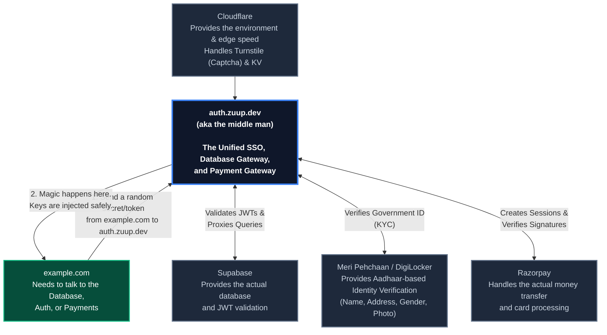

# Zuup Auth Gateway

[](https://deploy.workers.cloudflare.com/?url=https://github.com/Jagrit0711/zuup-auth-worker)

Zuup Auth Gateway is a high-performance authentication, identity, and database proxy built on Cloudflare Workers and Hono. It is designed to sit between your frontend applications and your backend services (like Supabase, Razorpay, or Identity Providers) to ensure that sensitive API keys and secrets are never exposed to the client browser.

## System Architecture



## How It Works

At its core, Zuup Auth acts as a secure middleware layer. 

1. **Database Proxy:** Frontend applications typically need to communicate with a database (like Supabase). However, exposing your Supabase Anon Key or Service Role Key in the frontend can lead to security vulnerabilities. With Zuup Auth, your frontend sends requests to auth.zuup.dev using a generic GATEWAY_SECRET. The worker intercepts this request, validates the secret, injects your actual Supabase keys securely from the edge, and proxies the request to the real database.
2. **Single Sign-On (SSO):** Zuup Auth functions as an OAuth 2.0 Identity Provider. You can redirect users from any of your side projects to the Zuup Auth login page. Once they authenticate, they are redirected back to your application with a temporary authorization code, which your backend can exchange for their user profile and JWT.
3. **Payment Gateway Integration:** Handling Razorpay webhooks and verifying signatures on every project is tedious. Zuup Auth unifies this. Your backend creates a payment session on Zuup Auth, your frontend opens the Zuup Auth payment UI in a popup, and upon successful payment, Zuup Auth automatically verifies the Razorpay signature and fires a secure RPC call to your Supabase database.
4. **KYC Identity Verification:** Zuup Auth integrates natively with Meri Pehchaan (DigiLocker) to perform Indian Government identity verification. It handles the redirect flow, extracts verified details (Name, Address, DOB, masked Aadhaar), stores them in your database, and returns a verified status to your frontend.

## Integration Guide

### 1. Database Proxy Setup

Instead of exposing your Supabase credentials in your frontend application, set your environment variables to point to your Zuup Auth instance:

```env
# Frontend .env
VITE_SUPABASE_URL=https://auth.yourdomain.com
VITE_SUPABASE_ANON_KEY=your_custom_gateway_secret
```

Initialize your Supabase client normally. All requests will now be routed through the worker, keeping your actual database keys completely hidden.

> **Security Note regarding JWTs and RLS:** 
> Zuup Auth verifies user sessions at the edge and securely passes the valid user JWT to Supabase. While hiding your Anon key prevents basic abuse, **it does not replace Row Level Security (RLS)**. Because valid authenticated users can still make requests, you must ensure your Supabase database has strict RLS policies enabled to govern exactly what data users can read or write.

### 2. Single Sign-On (SSO)

To implement "Sign in with Zuup" on your frontend:

1. Redirect the user to the login portal:
   `https://auth.yourdomain.com/login?client_id=YOUR_APP&redirect_uri=https://example.com/callback`
2. After successful authentication, the user will be redirected back with a code:
   `https://example.com/callback?code=zcode_123...`
3. Have your backend exchange this code for the user's JWT and profile:
   `POST https://auth.yourdomain.com/api/oauth/token`

### 3. Identity Verification (KYC)

To verify a user's real-world identity using DigiLocker:

1. Create a session from your backend:
```javascript
const response = await fetch("https://auth.yourdomain.com/api/kyc/create-session", {
  method: "POST",
  headers: { "Content-Type": "application/json" },
  body: JSON.stringify({
    redirect_uri: "https://example.com/kyc-success",
    client_name: "Example App"
  })
});
const { session_id } = await response.json();
```

2. Open the UI in a popup on your frontend:
```javascript
window.open(
  `https://auth.yourdomain.com/kyc?session_id=${session_id}`,
  'Zuup_KYC',
  'width=500,height=750'
);
```

### 4. Payments (Razorpay)

1. Create a payment session from your backend:
```javascript
const response = await fetch("https://auth.yourdomain.com/api/payments/create-session", {
  method: "POST",
  headers: {
    "Content-Type": "application/json",
    "apikey": process.env.GATEWAY_SECRET
  },
  body: JSON.stringify({
    amount: 1500,
    currency: "INR",
    site_name: "Example App",
    webhook_path: "/rest/v1/rpc/mark_ticket_paid",
    webhook_body: { user_id: "123" }
  })
});
const { sessionUrl, sessionId } = await response.json();
```

2. Open `sessionUrl` in a popup and poll `GET /api/payments/session/:id` until the status changes to `paid`.

## Local Development and Deployment

### 1. Supabase Setup

Before deploying, you must prepare your Supabase project:
1. **Create a Project:** Go to [supabase.com](https://supabase.com) and create a new project.
2. **Obtain API Keys:** Navigate to **Project Settings > API**. Here you will find your `Project URL`, your `anon` public key, and your `service_role` secret key.
3. **Obtain JWT Secret:** On the same API settings page (or under **Project Settings > API > JWT Settings**), find your `JWT Secret`.
4. **Enable Auth:** Go to **Authentication > Providers** and ensure Email/Password or your preferred login methods are enabled.
5. **Enforce RLS:** Ensure strict Row Level Security (RLS) policies are active on all public-facing tables.
6. **Migrations:** Run any necessary SQL migrations (like creating the `kyc_verifications` table) in the Supabase SQL Editor.

### 2. Environment Variables

Create a `.dev.vars` file in the root of the project for local development:

```ini
SUPABASE_URL=https://your-project.supabase.co
SUPABASE_ANON_KEY=your_real_anon_key
SUPABASE_SERVICE_ROLE_KEY=your_real_service_role_key
SUPABASE_JWT_SECRET=your_jwt_secret
TURNSTILE_SECRET_KEY=your_cloudflare_turnstile_secret
GATEWAY_SECRET=a_custom_secret_you_invent
```

### 3. KV Namespaces

You must create two Cloudflare KV namespaces. Run these commands in your terminal:
```bash
npx wrangler kv:namespace create RATE_LIMITER
npx wrangler kv:namespace create ZUUP_OAUTH
```
Update your `wrangler.jsonc` file with the IDs returned by those commands.

### 4. Running Locally

Install dependencies and start the Wrangler development server:

```bash
npm install
npm run dev
```

### 5. Deploying to Cloudflare on your own domain

1. Push your secrets to your Cloudflare account securely:
```bash
npx wrangler secret put SUPABASE_URL
npx wrangler secret put SUPABASE_ANON_KEY
npx wrangler secret put SUPABASE_SERVICE_ROLE_KEY
npx wrangler secret put SUPABASE_JWT_SECRET
npx wrangler secret put TURNSTILE_SECRET_KEY
npx wrangler secret put GATEWAY_SECRET
```
2. Deploy the worker:
```bash
npx wrangler deploy
```
3. To attach this worker to your own custom domain (e.g., `auth.yourdomain.com`), go to your Cloudflare Dashboard -> Workers & Pages -> Zuup Auth -> Triggers -> Custom Domains, and click "Add Custom Domain".

*Built with ❤️ for a safer, faster web*
