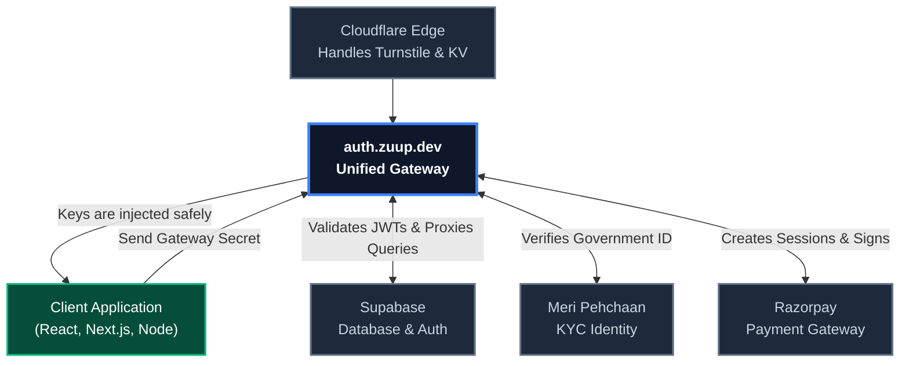

# Overview

Zuup Auth Gateway is a high-performance authentication, identity, and database proxy built on Cloudflare Workers and Hono. It is designed to sit directly between your frontend applications and your backend services (like Supabase, Razorpay, or Identity Providers) to ensure that sensitive API keys and secrets are never exposed to the client browser.

## The Problem: "The Dark Ages"

Historically, applications communicated directly with the database. We embedded Anon keys into our frontend clients, relying heavily on Row Level Security (RLS) to keep data safe. 

Unfortunately, RLS is notoriously difficult to configure perfectly at scale, leading to vulnerabilities. When malicious actors scraped the Anon keys from the frontend codebase, they were able to query the database directly, bypassing our UI logic entirely and orchestrating attacks.

## The Solution: The Edge Proxy

To completely eliminate this attack vector, we built the **Edge Proxy**. It is a hyper-fast Cloudflare Worker that sits between every client and our core infrastructure. Now, client applications are never given real database credentials.

### System Architecture

### High-Performance Caching

Our proxy utilizes Cloudflare's global CDN to cache public database queries. Heavily requested public tables (like event schedules or public profiles) are cached at the edge, drastically reducing database load and delivering responses in sub-10ms globally.

### Unified State

Because we run a vast ecosystem of interconnected apps (builder tools, admin panels, student dashboards), we needed a single source of truth for identity. Zuup Auth issues standardized JWTs stored in secure, HttpOnly Edge Cookies. This creates a seamless "Sign in with Zuup" SSO experience across every domain we operate.
